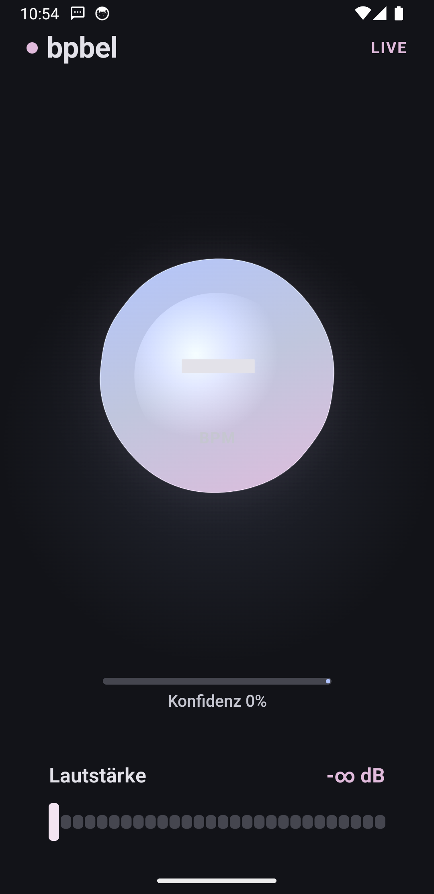
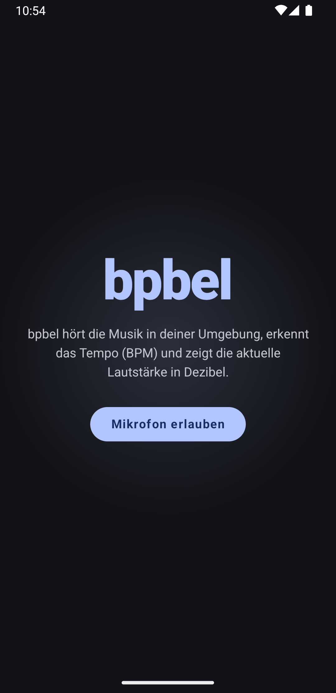

<div align="center">

# 🎵 bpbel

### Real-time **BPM** & **decibel** detection for Android — wrapped in a Material 3 *Expressive* interface.

[](https://developer.android.com)
[](https://developer.android.com/tools/releases/platforms#8.0)
[](https://developer.android.com/tools/releases/platforms)
[](https://kotlinlang.org)
[](https://developer.android.com/jetpack/compose)
[](https://m3.material.io)
[](https://developer.android.com/build)
[](#-testing)
[](LICENSE)
[](#)
[](#-contributing)

<br/>


&nbsp;&nbsp;


</div>

---

## ✨ Was bpbel macht

bpbel hört über das Mikrofon die Musik in deiner Umgebung und zeigt **live**:

- 🥁 **BPM** (Beats per Minute) — das Tempo des laufenden Tracks, erkannt über Kick-Onset-Detection.
- 🔊 **Dezibel** (dBFS) — die aktuelle Lautstärke, als animiertes Segment-Meter mit Peak-Hold.

Beides wird in einer **Material 3 Expressive** Oberfläche visualisiert: eine morphende Pulse-Form,
die im Takt der erkannten Beats federt (Spring-Physik), lebendige Verlaufsfarben, Glow-Ringe und
eine ruhige, atmende Hintergrund-Animation.

---

## 🧠 Wie die BPM-Erkennung funktioniert

Der Detektor ist ein **energie-basierter Onset-Detector mit IOI-Clustering** (Inter-Onset-Interval) —
der klassische, praxiserprobte Ansatz für 4/4-Musik mit klarem Kick (typische Genauigkeit 85–95 %).
Die Kernlogik ([`BpmAnalyzer.kt`](app/src/main/java/io/celox/bpbel/audio/BpmAnalyzer.kt)) ist ein
1:1-Port eines kampferprobten TypeScript-Detektors und wird durch eine **portierte Test-Suite**
(17 Tests) gegen das Original abgesichert.

```
Mikrofon (AudioRecord, 44.1 kHz mono PCM-16)
   │
   ├──▶ Full-band RMS ─────────▶ dBFS            ──▶ Lautstärke-Meter
   │
   └──▶ Kick-Bandpass (30–100 Hz, 2× Biquad)
            │
            ├─▶ RMS-Energie pro 1024-Sample-Frame
            ├─▶ gleitender Mittelwert (Baseline-Gate)
            ├─▶ Onset, wenn Energie > Schwelle · Mittelwert  (+ Refraktärzeit)
            ├─▶ Onsets → IOIs → Median → 60000 / Median = BPM
            ├─▶ Oktav-Korrektur (60–200 BPM) + Oktav-Snap (kein 120↔240-Flackern)
            └─▶ 4-s-Fenster-Mittel = stabiler Anzeigewert  (+ Stale-Reset bei Stille)
```

**Konfidenz** entsteht aus der IOI-Konsistenz (`1 − stddev/median`): ein gleichmäßiger
Viertel-Puls liefert ~0,9, Sprache/Rauschen ~0,1.

> Warum kein FFT/Autokorrelation? Für „welcher Track läuft gerade — 120, 140 oder 170?" ist
> Onset-Detection deutlich günstiger (kein FFT) und völlig ausreichend.

---

## 🎨 Material 3 Expressive

| Element | Umsetzung |
|---|---|
| **Theme** | [`MaterialExpressiveTheme`](app/src/main/java/io/celox/bpbel/ui/theme/Theme.kt) — alle M3-Komponenten erben das feder-basierte *expressive* `MotionScheme`. |
| **Motion** | Beat-Puls über `Animatable` + `spring(dampingRatio = 0.34)` → lebendiger Overshoot. |
| **Shapes** | Morphing Circle ↔ Star via `androidx.graphics:graphics-shapes` (`Morph`, `RoundedPolygon`). |
| **Color** | Vibrantes Violett → Magenta → Cyan; **Dynamic Color** auf Android 12+. |
| **Typografie** | Emphasized Type-Scale (Black/Bold) für die Hero-Numerik. |

---

## 🚀 Build & Run

**Voraussetzungen:** JDK 17, Android SDK (compileSdk 36), ein Gerät/Emulator mit Mikrofon.

```bash
# Debug-APK bauen
./gradlew :app:assembleDebug

# Auf verbundenem Gerät/Emulator installieren
./gradlew :app:installDebug
# oder:
adb install -r app/build/outputs/apk/debug/app-debug.apk

# Release (minified, R8)
./gradlew :app:assembleRelease
```

Beim ersten Start fragt die App die **`RECORD_AUDIO`**-Berechtigung an. Danach genügt es, das Gerät
in die Nähe einer Musikquelle zu halten — der BPM-Wert pendelt sich nach ~5 Sekunden ein.

---

## 🧪 Testing

```bash
./gradlew :app:testDebugUnitTest
```

[`BpmAnalyzerTest`](app/src/test/java/io/celox/bpbel/BpmAnalyzerTest.kt) synthetisiert Onset-Trains
bei bekannten Tempi (90/120/175 BPM, Half-/Double-Time) und prüft Lock-on, Oktav-Korrektur,
Refraktärzeit, Stale-Reset, Oktav-Snap und Konfidenz — als Beweis, dass der Kotlin-Port das
Verhalten des Referenz-Algorithmus exakt reproduziert.

---

## 🏗️ Projektstruktur

```
app/src/main/java/io/celox/bpbel/
├── MainActivity.kt              # Permission-Flow + Engine-Lifecycle
├── audio/
│   ├── BpmAnalyzer.kt           # Onset/IOI-Tempo-Detektor (portiert)
│   ├── Biquad.kt                # RBJ-Biquad + Kick-Bandpass (30–100 Hz)
│   └── AudioEngine.kt           # AudioRecord → dBFS + BPM → StateFlow
└── ui/
    ├── BpmScreen.kt             # Screen-Layout + Permission-States
    ├── BeatPulse.kt             # Morphende Spring-Puls-Visualisierung
    ├── DecibelMeter.kt          # Segment-Meter mit Attack/Release + Peak-Hold
    └── theme/                   # Material 3 Expressive Theme/Color/Type
```

---

## ⚠️ Bekannte Grenzen

- **dBFS ≠ kalibrierte SPL** — relativer digitaler Pegel (abhängig von Mikrofon-Gain/AGC), keine echte akustische Dezibel-Messung.
- Genauigkeit folgt dem Onset-Ansatz: stark auf 4/4-Musik mit klarem Kick, schwächer bei synkopiertem/ambientem Material.
- Hört nur im **Vordergrund** (kein Background-Service).

---

## 🤝 Contributing

PRs willkommen. Bitte vor dem Push `./gradlew testDebugUnitTest` laufen lassen.

## 📄 License

[MIT](LICENSE) © pepperonas
